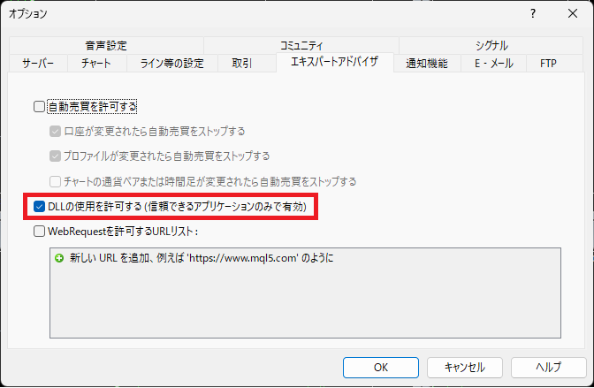

# [MT4/5][RepopAlert.ex4/5](.)

閉じてしまったアラートダイアログをいつでも再表示することが出来ます。

## 詳細

1. インジケーターです。[Indicators](../../Indicators/)フォルダに格納してご利用ください。
1. チャート上の[Repop]ボタンをクリックするとアラート画面が表示されます。
1. [DLLの使用を許可する]にチェックを入れてください。

## History
Ver1.00 2023/07/25　新規作成