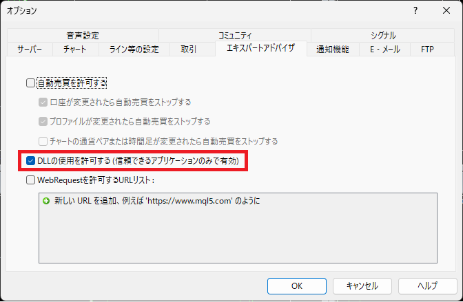

# [MT4]RepopAlertSC

閉じてしまったアラートダイアログをいつでも再表示することが出来ます。

## 詳細

1. スクリプトです。Scriptsフォルダに格納してご利用ください。
1. RepopAlertSCをチャートにドラッグ&ドロップしてください。
1. アラートが発生していない場合はアラートダイアログは表示されません。
1. 英語で動作させている場合は「RepopAlertSC(eng)」を利用してください。
1. オプションのエキスパートアドバイザで[DLLの使用を許可する]にチェックを入れてください。

## History
Ver1.00 2023/07/27　新規作成